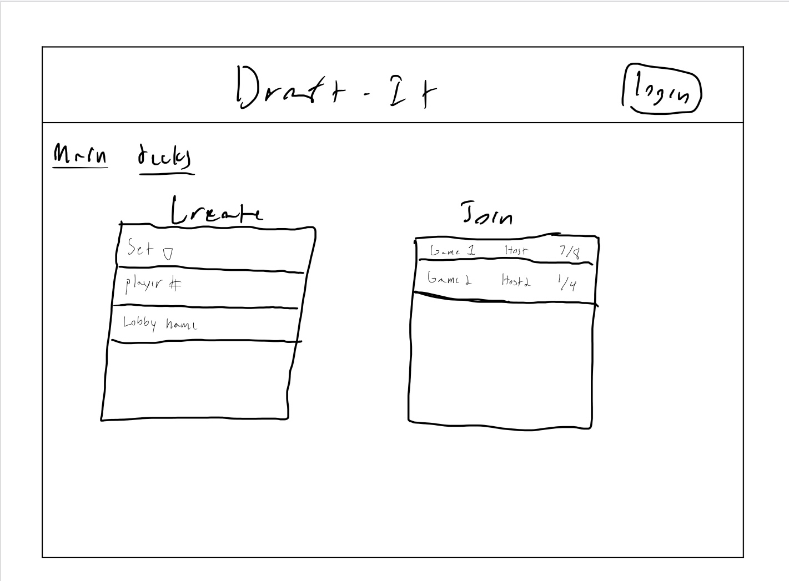
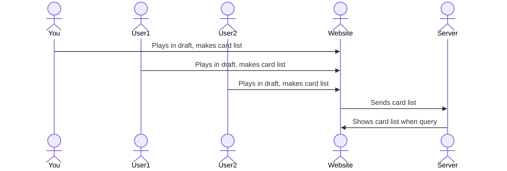

# Draft-It

[My Notes](notes.md)

This application will be used for setting up Magic the Gathering drafts online with other users. By creating or joining lobbies you will interface with the application to select cards from a set of packs that are decided by the host, following typical pack rules from the draft boosters of the respective set. Rarities, pull odds, and how the packs are filled will all be maintained as per real life pack rules.

The application will present you with the cards in the pack, from which you will choose one, and then the rest of the cards will be given to the next user in current order. After repeating until the last card in the pack is picked, the next pack will repeat the process in reverse turn order, and then the last pack in original turn order. Each user will then be given the option to export their created card list to MTGA, MTGO, or just copy to clipboard. 

## 🚀 Specification Deliverable

For this deliverable I did the following. I checked the box `[x]` and added a description for things I completed.

- [x] Proper use of Markdown
- [x] A concise and compelling elevator pitch
- [x] Description of key features
- [x] Description of how you will use each technology
- [x] One or more rough sketches of your application. Images must be embedded in this file using Markdown image references.

### Elevator pitch

Despite the abundance of playing platforms for Magic the Gathering, some of the most popular formats of the game are only incorporated in fan made platforms, or not at all. One of these examples is a MTG draft, one of the core foundations of the game, something local game stores fill up every friday night for. Despite it's popularity, drafting online has few viable or well put together options. By drafting in real time using an inuitive and clear system, and then exporting the draft to another platform of choice to play on, users will be able to enjoy drafting even when budget or personal constraints would otherwise not permmit.

### Design

Above is a picture of what the main HTML page will look like, below is a diagram of how users will interact with the website, and the website and server will interact.

### Key features

- Secure HTTPS login
- Ability to create or join draft lobbies
- Visual display of each card
- Ability to pick cards to keep
- Draft card lists stored and tied to account
- Ability to export draft to MTGA, MTGO, or copy to clipboard
- Ability to select the set the packs of the draft are from
- Ability to select the number of players in the draft
- Standard draft pick and pass play

### Technologies

I am going to use the required technologies in the following ways.

- **HTML** - Uses proper HTML structure for application. 6 HTML pages. One for login, one for main page, one for lobby waiting room, one for drafting, one for deck storage, one for the deck list.
- **CSS** - Application styling using neutral colors to not inhibit card visibility, mainly designed for desktop experience, good levels of reading.
- **React** - Provides login, card choice and display, routing using React and JavaScript.
- **Service** - Backend service for:
    - draft creation/joining
    - draft card list storage
    - retrieving card lists
    - displaying cards using [Scryfall API](https://api.scryfall.com)
- **DB/Login** - Store users and card lists in database, register and login users, securely store credentials, authenticate users before draft elegible.
- **WebSocket** - As each user picks cards the remaining cards from that pack are sent to the next user.

## 🚀 AWS deliverable

For this deliverable I did the following. I checked the box `[x]` and added a description for things I completed.

- [x] **Server deployed and accessible with custom domain name** - [My server link](https://draftmagic.click).

## 🚀 HTML deliverable

For this deliverable I did the following. I checked the box `[x]` and added a description for things I completed.

- [x] **HTML pages** - I added index, lobby, draft, decklist, decks, and about HTML. Two are only reachable through pages. Draft through the join button on Lobby and decks through the deck buttons on decklist
- [x] **Proper HTML element usage** - I used proper formatting for HTML elements
- [x] **Links** - I added necessary links between pages of the website
- [x] **Text** - I applied proper contextual text formatting
- [x] **3rd party API placeholder** - I have images as the 3rd part api placeholder on the draft html page
- [x] **Images** - I dadded images to draft
- [x] **Login placeholder** - I have login placeholder on index
- [x] **DB data placeholder** - I have DB data placeholder on decklist, the decks are what is stored
- [x] **WebSocket placeholder** - I have WebSocket placeholder on lobby with chat, and draft wherethe cards are what is sent through the WebSocket

## 🚀 CSS deliverable

For this deliverable I did the following. I checked the box `[x]` and added a description for things I completed.

- [x] **Header, footer, and main content body** - Formatted all header, footer, and main content
- [x] **Navigation elements** - Properly formatted the navigation elements
- [x] **Responsive to window resizing** - Made as responsive as possible to window resizing, Lobby was especially hard
- [x] **Application elements** - Basically made everything a grid and used containers to make it all look nice
- [x] **Application text content** - I put most everything in the same kind of container as far as text in concerned
- [x] **Application images** - Used a grid to make these resize properly with the window

## 🚀 React part 1: Routing deliverable

For this deliverable I did the following. I checked the box `[x]` and added a description for things I completed.

- [ ] **Bundled using Vite** - I did not complete this part of the deliverable.
- [ ] **Components** - I did not complete this part of the deliverable.
- [ ] **Router** - Routing between login and voting components.

## 🚀 React part 2: Reactivity

For this deliverable I did the following. I checked the box `[x]` and added a description for things I completed.

- [ ] **All functionality implemented or mocked out** - I did not complete this part of the deliverable.
- [ ] **Hooks** - I did not complete this part of the deliverable.

## 🚀 Service deliverable

For this deliverable I did the following. I checked the box `[x]` and added a description for things I completed.

- [ ] **Node.js/Express HTTP service** - I did not complete this part of the deliverable.
- [ ] **Static middleware for frontend** - I did not complete this part of the deliverable.
- [ ] **Calls to third party endpoints** - I did not complete this part of the deliverable.
- [ ] **Backend service endpoints** - I did not complete this part of the deliverable.
- [ ] **Frontend calls service endpoints** - I did not complete this part of the deliverable.

## 🚀 DB/Login deliverable

For this deliverable I did the following. I checked the box `[x]` and added a description for things I completed.

- [ ] **User registration** - I did not complete this part of the deliverable.
- [ ] **User login and logout** - I did not complete this part of the deliverable.
- [ ] **Stores data in MongoDB** - I did not complete this part of the deliverable.
- [ ] **Stores credentials in MongoDB** - I did not complete this part of the deliverable.
- [ ] **Restricts functionality based on authentication** - I did not complete this part of the deliverable.

## 🚀 WebSocket deliverable

For this deliverable I did the following. I checked the box `[x]` and added a description for things I completed.

- [ ] **Backend listens for WebSocket connection** - I did not complete this part of the deliverable.
- [ ] **Frontend makes WebSocket connection** - I did not complete this part of the deliverable.
- [ ] **Data sent over WebSocket connection** - I did not complete this part of the deliverable.
- [ ] **WebSocket data displayed** - I did not complete this part of the deliverable.
- [ ] **Application is fully functional** - I did not complete this part of the deliverable.
